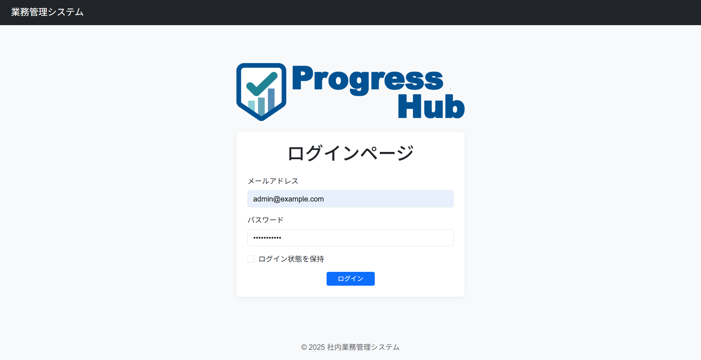
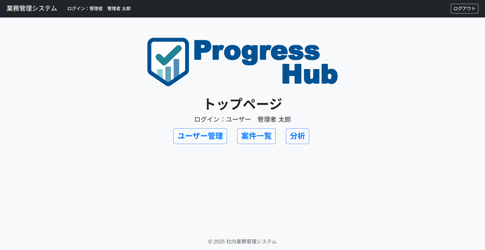
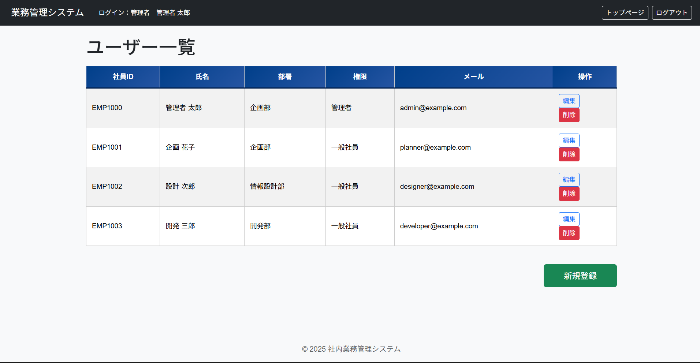
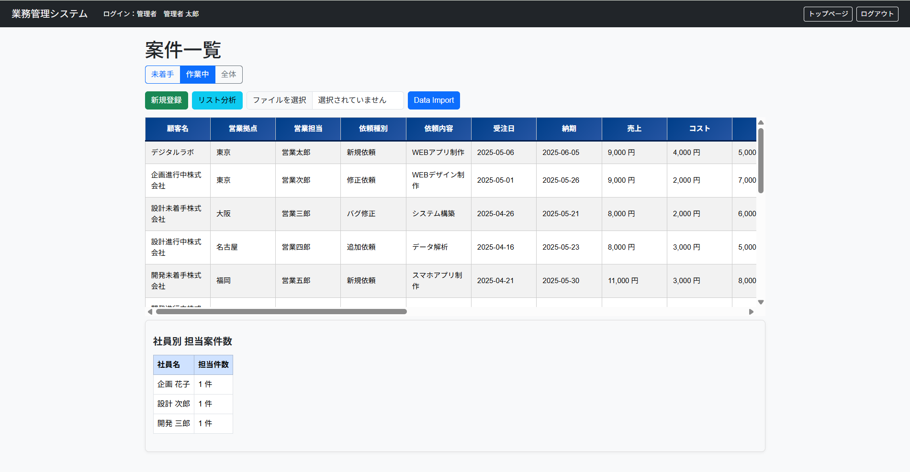
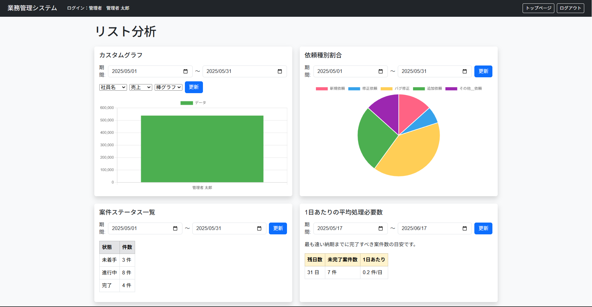
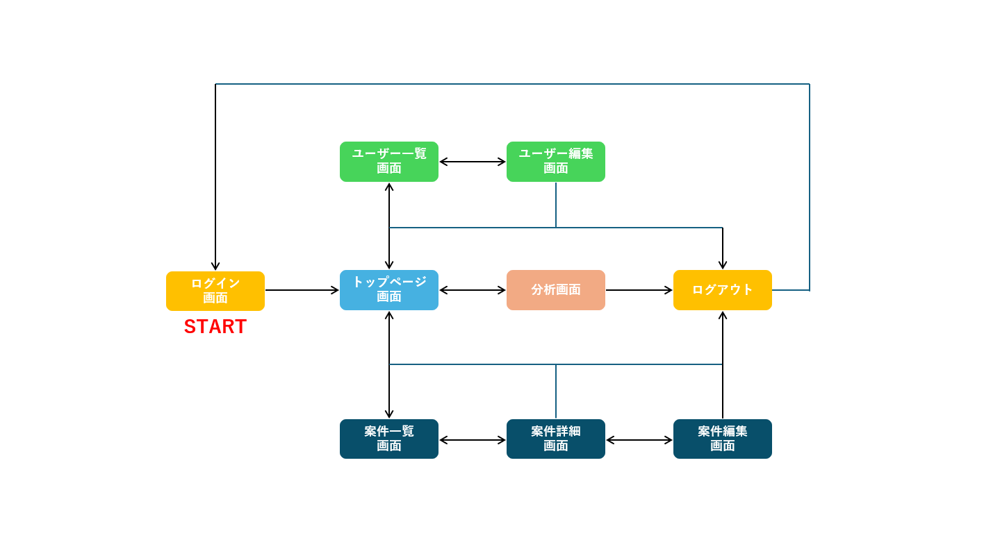
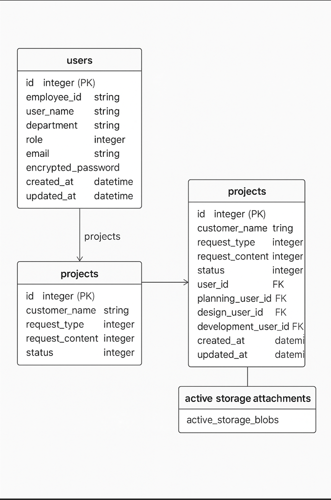

# ProgressHub（プログレスハブ）

「Progress（進捗）」＋「Hub（集約地点）」を意味する業務進行管理システム

---

## アプリケーション概要

ProgressHub は、複数部署の進捗・実績・担当情報を一元管理できる業務支援システムです。  
管理者は各案件の進行状況をリアルタイムに把握でき、部署担当者は自分の担当分のみを効率的に処理できます。

- 案件の進捗を部署ごとに段階管理（企画・設計・開発）  
- 部署別UI・表示制御（役割に応じて表示項目が切り替わる）  
- ActiveStorageを使ったファイル添付・削除  
- Chart.jsによる分析機能（グラフ表示）  
- ロール別ログイン・管理者用ユーザー管理

---

## アプリケーションを作成した背景

前職で、部門ごとに進捗管理が分散し、業務報告や確認に大きな手間がかかっていた経験から、  
「部署ごとに必要な情報だけを見せつつ、全体は一元管理したい」という課題を解決するアプリケーションとして **ProgressHub** を開発しました。  
**「情報共有・見える化・効率化」** を目的に、社内の業務DXを後押しすることを目指しています。

---

## URL

🔗 https://app-42189-original.onrender.com  
※ Render による本番環境にデプロイ済み

---

## テスト用アカウント

| ロール           | メールアドレス               | パスワード     |
|------------------|-------------------------------|----------------|
| 管理者ユーザー   | `admin@example.com`           | `password123`  |
| 企画担当         | `planner1@example.com`        | `password123`  |
| 設計担当         | `designer1@example.com`       | `password123`  |
| 開発担当         | `developer1@example.com`      | `password123`  |

※ 各部署にユーザーが3名ずつ登録されています  
（例：`planner2@example.com`, `designer3@example.com` など）

---

## 利用方法

1. ログイン画面からテストユーザーでログイン  
   ※管理者ユーザーと担当ユーザーで画面表示が変わります  
2. トップページより各機能に遷移  
3. ユーザー一覧・編集・削除（管理者のみ）  
4. 案件の一覧・詳細・編集（部署ごとに表示制御、削除は管理者のみ）  
5. 分析ページにて、案件の進行状況や依頼区分の割合などをグラフ表示（管理者のみ）

## アプリ説明
- [📄 ProgressHubの説明を見る（PDF）](./public/ProgressHubの説明.pdf)

## テスト用インポートデータ
案件を一括登録するためのサンプルExcelファイルを同梱しています。  
- [📥 Excelマクロファイルをダウンロード](./public/sample_projects.xlsm)

1. Excel のマクロを有効にする  
2. 「リスト作成」ボタンで行数を指定して案件を自動生成  
3. Excelファイルを保存する  
4. アプリ内の「案件一覧」画面下部でファイルをアップロードし「Data Import」ボタンを押す

※リスト作成を間違った場合は削除ボタンでやり直してください  
※一部未入力カラム（企画IDなど）はマッピング用のため無視してOKです

---

## 実装した機能の画像やGIF

| 機能名                | 画像ファイル例 (クリックで表示)                                                         |
|-----------------------|--------------------------------------------------------------------------------------|
| ログイン画面           | [](./screenshots/login.png)                         |
| トップページ           | [](./screenshots/home.png)                            |
| ユーザー一覧           | [](./screenshots/users_index.png)             |
| 案件一覧（部署別UI）   | [](./screenshots/projects.png)                 |
| 分析画面（チャート表示）| [](./screenshots/analytics_index.png) |

---

## 画面遷移図



---

## ER図



---

## 主な機能

### ユーザー機能（Devise使用）

- ログイン / ログアウト（全ユーザー）
- ユーザー一覧・新規登録・編集・削除（管理者のみ）

### 案件管理機能

- 新規登録 / 削除（管理者のみ）
- 編集 / 詳細確認
- Excelなどのデータインポート（管理者のみ）
- 担当部署別の進行状況表示（企画・設計・開発に応じて制御）
- 添付ファイル（ActiveStorage）
- 売上・コスト・利益の数値管理（管理者のみ）

### 分析機能（管理者のみ）

- 部署別・社員別の案件数（期間設定・XY軸組み合わせ可）
- 納期までの日数別グラフ（期間設定可）
- 依頼内容や依頼種別の割合表示（期間設定可）

---

## 本番環境への注意

### ⚠️ `rails db:seed` の扱いについて

Render の `render-build.sh` に `rails db:seed` を記述したままデプロイすると、  
**本番データが毎回削除される危険性があります**。

```bash
# render-build.sh（初回だけ seed を実行し、その後は削除 or コメントアウト）
bundle exec rails db:migrate
# bundle exec rails db:seed ← ⚠️ 初回以外は削除またはコメントアウト！
```

---

## 工夫したポイント

- **部署別UIの自動切り替え**  
  ログインユーザーの部署に応じて、案件一覧の表示内容・編集可能項目が動的に変化するように実装。

- **管理者と一般社員の明確な権限分離**  
  ロールによって画面表示・機能（ユーザー管理・削除・分析など）を制御し、業務統制と操作性を両立。

- **添付ファイル（ActiveStorage）対応**  
  案件詳細でファイル添付＆削除が可能。PDFや画像もアップロード対応。

- **Chart.jsによるグラフ分析**  
  XY軸を動的に変更でき、納期・依頼内容などをグラフで視覚的に把握。

- **Split.jsによる上下分割レイアウト**  
  案件一覧と分析グラフを分割表示しながら同時閲覧できる画面構成。

---

## 今後の課題

- 案件の完了アラート通知機能  
- CSV / Excelエクスポート機能  
- 管理者による承認フロー機能  
- 社員スケジュールのカレンダー・チャート表示  
- パフォーマンス最適化（N+1解消・インデックス強化）

---

## 開発環境

| 項目             | バージョン・サービス           |
|------------------|------------------------------|
| 言語              | Ruby 3.2.0                    |
| フレームワーク     | Ruby on Rails 7.1.5.1         |
| フロントエンド     | HTML / SCSS / JavaScript      |
| ライブラリ         | Bootstrap / Chart.js / Split.js |
| 認証機能           | Devise                        |
| DB（開発）         | MySQL 8.0                     |
| DB（本番）         | PostgreSQL 14                 |
| デプロイ           | Render                        |
| テスト             | RSpec / FactoryBot            |
| 画像添付管理       | ActiveStorage                 |
| バージョン管理     | Git / GitHub                  |

---

## ローカルでの実行方法

```bash
# クローン
git clone https://github.com/d-magaki/app-42189-original.git

# gemインストール
bundle install

# データベース作成・マイグレート・初期データ投入
rails db:create
rails db:migrate
rails db:seed  # ※初回のみ実行

# サーバ起動
rails s

# 確認用URL
http://localhost:3000

```

## 制作期間

約2週間